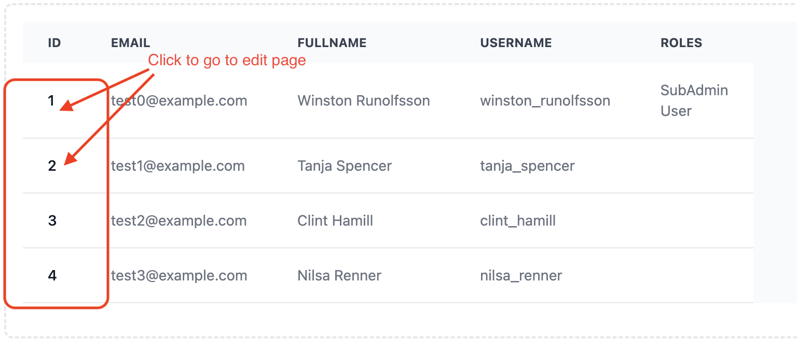

## Requirements
- Ruby: 3.2.1
- Rails: 7.1.3
- Nodejs: 16.15.1

## How to run
1. Run docker build
  ```
  docker-compose up --build
  ```
2. Create database and data
  ```
  docker-compose run app ./bin/rails db:drop db:create db:migrate db:seed
  ```
3. Access to `localhost:3000`

4. For mail service, access mailhog at: `http://localhost:8025/`

## How to use application
### With new user
#### step 1
- Register new account
- Access mailhog at: `http://localhost:8025/`
- Active account
- Login with registered account
#### step 2
- You can create new team from New section in dashboard
- You can login with seed accounts


## Roles rules
### Default roles
- After created, each team will have 3 default roles: TeamAdmin, SubAdmin, User
- Permissions:
  - `TeamAdmin`
    - `users` => `[read write delete]`
    - `teams` => `[read write]`
    - `roles` => `[read write delete]`
  - `SubAdmin`
    - `users` => `[read write delete]`
    - `teams` => `[read write]`
    - `roles` => `[read]`
  - `User`
    - `users` => `[read]`
    - `teams` => `[read]`
    - `roles` => `[read]`
### Owner roles
- Do not allow to delete default roles
- Full permissions

## Notes



